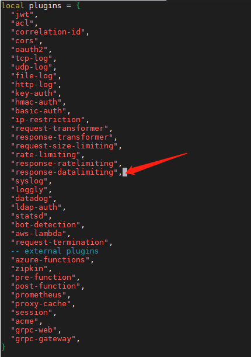
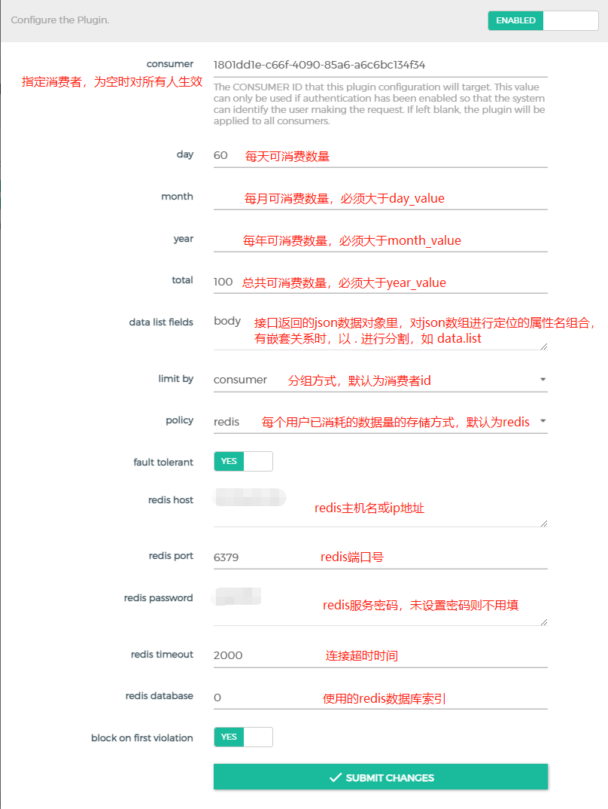

# response-datalimiting

## 插件使用场景
`Kong`网关的自带插件里，仅存在对request/response的请求频次进行限制的插件，
实际业务场景下，存在对具体的某个数据接口，从`天/月/年/总量`这四个维度，限制用户调用的总数据条数的需求。

之前在Google、GitHub、Gitee上做过检索，没有满足这种场景的可用插件，因此借鉴官方`request-ratelimiting`插件的实现方式，
实现了以下四种需求：
- 限制用户每天可以调用的数据量；
- 限制用户每月可以调用的数据量；
- 限制用户每年可以调用的数据量；
- 限制用户总共可以调用的数据量；


## 插件生效方式
这里仅以通过类似 `yum install -y kong-2.4.0.el7.amd64.rpm --nogpgcheck` 的安装方式为前提进行说明！

1. 修改 `/usr/local/share/lua/5.1/kong/constants.lua`，添加`response-dataliminting`插件
```shell
# 切换到 kong 的安装路径
cd /usr/local/share/lua/5.1/kong/

# 修改 constants.lua 文件
vim constants.lua
```


2. 将下载的`response-dataliminting`文件夹放到`/usr/local/share/lua/5.1/kong/plugins/`路径下
```shell
# 移动文件夹到kong的plugins目录下
mv response-datalimiting_download_path/response-dataliminting /usr/local/share/lua/5.1/kong/plugins/

# 重启kong服务，这里kong.conf配置文件使用自己配置的实际路径
kong restart -c /etc/kong/kong.conf --vv

# 查看运行日志
tail -f /usr/local/kong/logs/access.log
tail -f /usr/local/kong/logs/error.log
```
## 插件配置说明
该插件是以`request-ratelimiting` 为蓝本进行修改而来，配置方式与它无异！

这里着重说明`data_list_field`的配置，如某个接口返回的json数据为：
```json
{
  "msg":"success",
  "data":{
    "total":10000,
    "list":[0,1,2,3,4,5,6,7,8,9]
  },
  "status":200
}
```
那么，`data_list_field`的值就应该是 `data.list`


